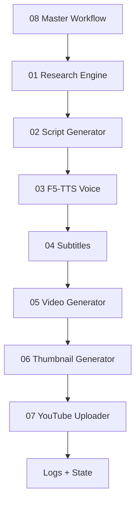

# Architecture

The n8n layer orchestrates idempotent Python scripts. Python owns API calls, media processing, retry behavior, filesystem state, and upload logic. Generated artifacts are stored in deterministic folders by job id, allowing failed runs to be resumed or repeated safely.
