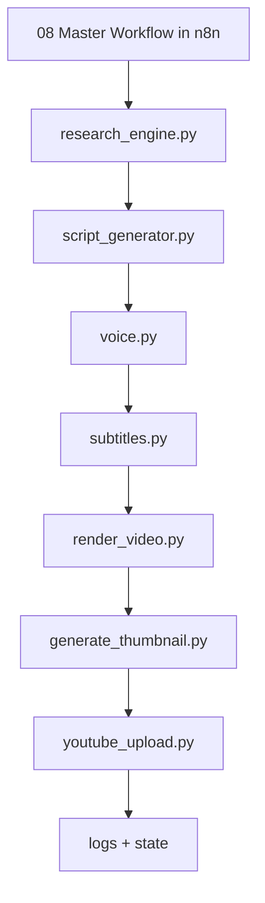

# Architecture

The system is Python-first. n8n is intentionally small and reliable: it uses only standard trigger, set, execute-command, read-file, and code nodes to run complete Python programs in sequence. All API integrations, retries, duplicate detection, rendering, caption generation, thumbnail creation, scheduling, and uploads live in Python.
